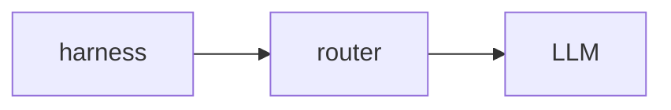
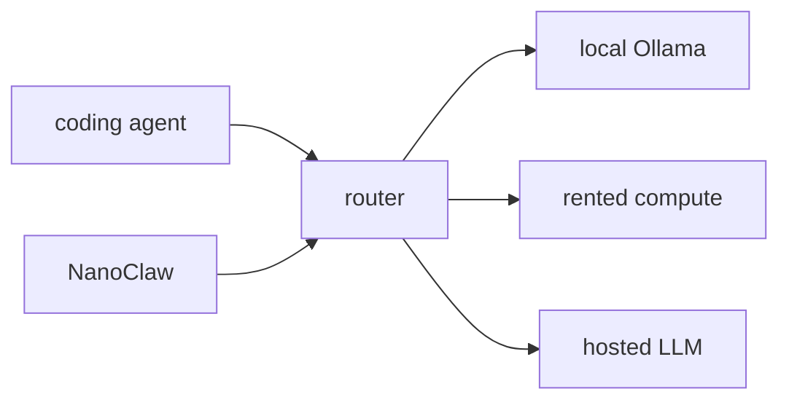

---
tags:
  - epistemic-status:budding
---

As [Daniel Miesler said](https://danielmiessler.com/blog/inference-costs-are-not-sustainable):

> My recommendation: Start planning your Multi / Local / Cheaper model strategy for your harness.

Different [[AI Engagement Patterns]] demand different infrastructure. The [[Abstraction and Autonomy in Human-AI Collaboration|level of abstraction]] in requests determines which backend to use -- vague goals need capable models, specific instructions need simple ones. You'll diversify your models and route intelligently based on the engagement pattern and context.

## Architecture

The harness gets the user's input, enriches it with context etc, then sends a request to router. The router then decides which LLM backend to use.

Criteria for the router's decision could include

- cost: local LLMs for routine queries, remote for complex/specialized tasks
- latency: local for real-time interactions, remote when response time is less critical
- capability: local for general tasks, remote for domain-specific or state-of-the-art reasoning

An example:

## Links

- My Mastodon post about Miesler and the Reddit post about Anthropic-internal incentives: https://hachyderm.io/@heichblatt/116358671645168158
